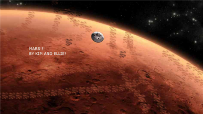

# Sonic Pi Competition Finalists 2014/15

To celebrate the launch of [Sonic Pi 2](http://www.raspberrypi.org/learning/sonic-pi-competition-2014/) we launched the inaugural Sonic Pi Competition. We were looking for some of the best space-themed music, coded with Sonic Pi v2.0 by school children in the UK, and we were not disappointed. 

The competition was open to all pupils attending a UK school aged 7 - 16 years, and we placed all the entries into three categories: KS2 Primary, KS3 Middle School or Secondary, and KS4 Secondary. As it turned out, we had a lot more primary entries than any other category, so we decided to simply select our favourite 10 from these entries!

After a month of judging, we have whittled all the entries down to just **ten finalists**. 

1. **'One Small Step' by Helen Towers**

  
  
  - [audio](audio/one-small-step.wav)
  - [code](code/one-small-step.rb)
  
  *A rocket takes off for the moon. It flies through space, and lands on the moon. An astronaut descends to the surface of the moon.*

  Our Lady's Catholic High School, Preston

1. **'The Space In Your Ears' by Elisa Caro**

  
  
  - [audio](audio/space-in-your-ears.wav)
  - [code](code/space-in-your-ears.rb)
  
  *I’ve chosen this kind of music, because if I close my eyes and listen to it I dream that I’m in space. I’ve used “in thread” that makes the music sound together. I’ve also used “play rrand” that makes every beat sound different. If you type “withfx: …” it will sound with any type of effect that you want. Also if you type “sample: …” you can use lots of musical instruments. I‘ve had lots of fun doing it. I would love to do it again.*

  Lavant House School, West Sussex

1. **'The Space Symphony' by Chenyang Li**

  
  
  - [audio](audio/space-symphony.wav)
  - [code](code/space-symphony.rb)
  
  *This piece of music describes the universe in a dazzling array of music. The techniques involved combine classic techniques used in each era of classical music. At first, only the bass resembling the Earth is audible. This resembles the little understanding humans had of the universe at the very, very beginning. When the second melody and third melody come in, the music is less bleak and richer. Humans now have more understanding of the universe, but there are still big questions that we have not answered. However, soon, a flurry of discoveries shook the scene. The climax in the music represents this. Dissonances and the interweaving harmonies represent the upheaval of these discoveries. Then the third piece enters and this represents the better understanding we have of the universe. Finally, pieces drop out and bring this symphony to a standstill but the exploration of space continues… forever!*

  Friends' School, Lisburn, County Antrim

1. **'Journey to Mars' by Jude Young**

  
  
  - [audio](audio/journey-to-mars.wav)
  - [code](code/journey-to-mars.rb)
  
  *This music is about me and my family going to Mars. First we shoot up into the sky then, suddenly, we break through the atmosphere into dark and lonely space. We keep going up, and eventually we see random objects floating by. We now see our target: Mars. We swoosh into landing position and slowly drop down, little retro rockets stabilising us. We hit the hard, rocky and dusty ground. We made it to MARS!!!*
  
  Clifton College Preparatory School, Bristol

1. **'Mars' by Ellie and Kimberley**

  
  
  - [audio](audio/mars.wav)
  - [code](code/mars.rb)
  
  *First, there is a countdown… 10, 9, 8, 7, 6, 5, 4, 3, 2, 1, blastoff!! The spacecraft zooms off into outer space. Then, the captain powers the engine up to go faster. After six months, they finally see Mars up close. Next, the proximity alarm goes off as a sign that they need to get ready to land with a sudden thump. As soon as the astronauts set foot on the red planet, they see small, purple aliens approaching with tools of torture. Before you could say "alien planet", the astronauts dived back into the rocket and shut the door. They suddenly went into emergency liftoff.*

  Kilkhampton Junior and Infant School, Cornwall  

1. **'Alien Chase' by Hamish Starling**

  
  
  - [audio](audio/alien-chase.wav)
  - [code](code/alien-chase.rb)
  
  *I created the front cover using pixel art, by filling squares in a pattern on a spreadsheet. In this music I am imagining an astronaut being chased by an alien. In the fast parts they are running quickly. At the end the astronaut gets shot by the alien’s ray gun. Does the astronaut survive?*
  
  Little Green Junior School, Hertfordshire

1. **'Space Adventurers' by Sai and Vrinda**

  

  - [audio](audio/space-adventurers.wav)
  - [code](code/space-adventurers.rb)
  
  *We created this piece by trial and error. Our music is called "Space Adventurers". We tested out some notes and if we liked it we put it in. We started off by looking at all of the sounds. We put them in and tested them out with loops and stuff like that. We did this because we'd get a better variety of notes and tunes. It was all about our perseverance - that's how we got to this!*
  
  Caroline Haslett Primary School, Milton Keynes

1. **'Planet Pi' by Joshua Lowe**

  
  
  - [audio](audio/planet-pi.wav)
  - [code](code/planet-pi.rb)
  
  *I am currently studying for my Grade 1 piano. This helped me a lot when making this piece as I was able to use knowledge of chords and scales. I attend Raspberry Jam Preston and Blackpool, as well as CoderDojo Blackpool, which helps me learn programming skills. I also run a lunchtime code club at my primary school. In this piece on Sonic Pi I imagined a young boy who pressed the big red button of a shuttle. He was launched into space, passed shooting stars and Planet Pi, then came back down again.*

  St Mary Magdalen's Catholic Primary, Preston
  
1. **'Super Space' by Jack, Ethan & Connor**

  
  
  - [audio](audio/super-space.wav)
  - [code](code/super-space.rb)
  
  *Our piece of music is about someone landing on the moon; walking on the moon with a cool beat. Some lunar rovers are racing, with a racing car sound. There are some aliens landing, with a sliding thud and an invasion alarm by Ethan. There is a parallel beat for 40 beats, and some higher-pitched beats by Connor that loop. Then there is another racing lunar rover, and another person walking on the moon.*

  Kilkhampton Junior and Infant School, Cornwall

1. **'Equinox' by Absolute Magnitude (George Tuli)**

  
  
  - [audio](audio/equinox.wav)
  - [code](code/equinox.rb)
  
  *After hearing about the Sonic Pi 2.0 competition we (three band members) decided this was an opportunity to put our coding skills to the test, and accelerate the journey to fame of our band, Absolute Magnitude. Based on Pachelbel's 'Canon', the song has its roots in classical music, but the electronic style maintains modern music trends, similar to those of 'Lemon Jelly'.*

  Soham Village College

If your entry does not appear in the list above then I'm afraid that you have not made it through to the semi-finals. But you can turn that frown upside down, as we are going to select random entries to win a number of Raspberry Pi 2's! 
